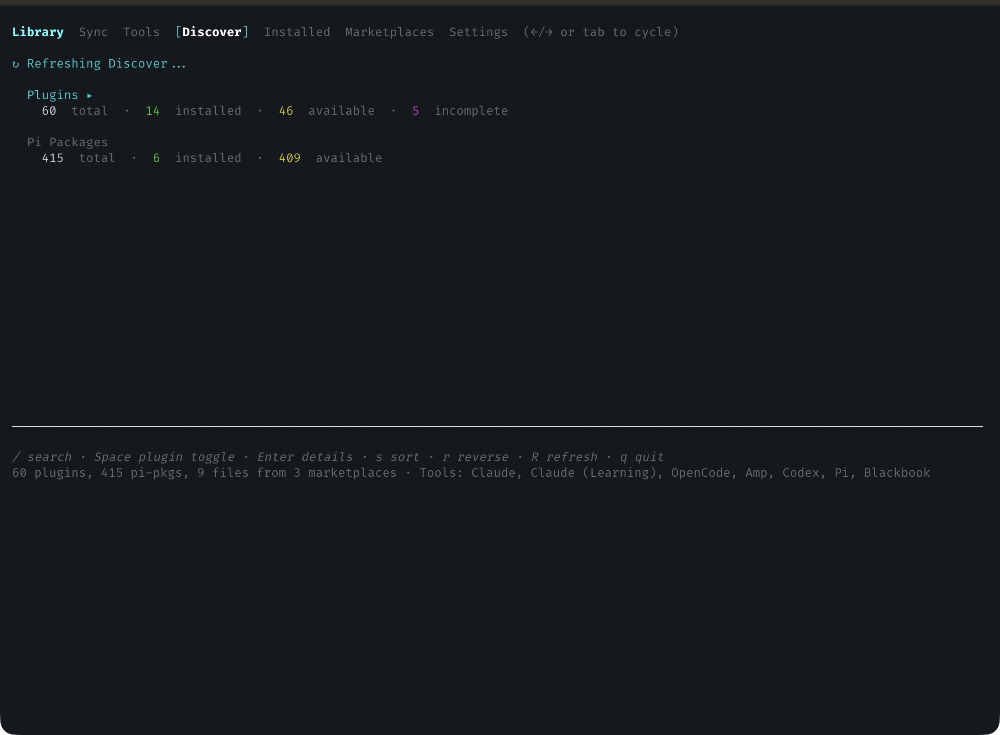
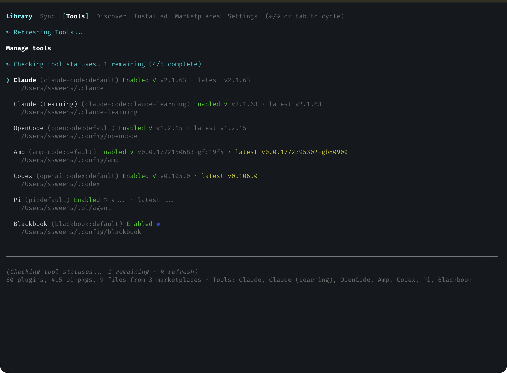
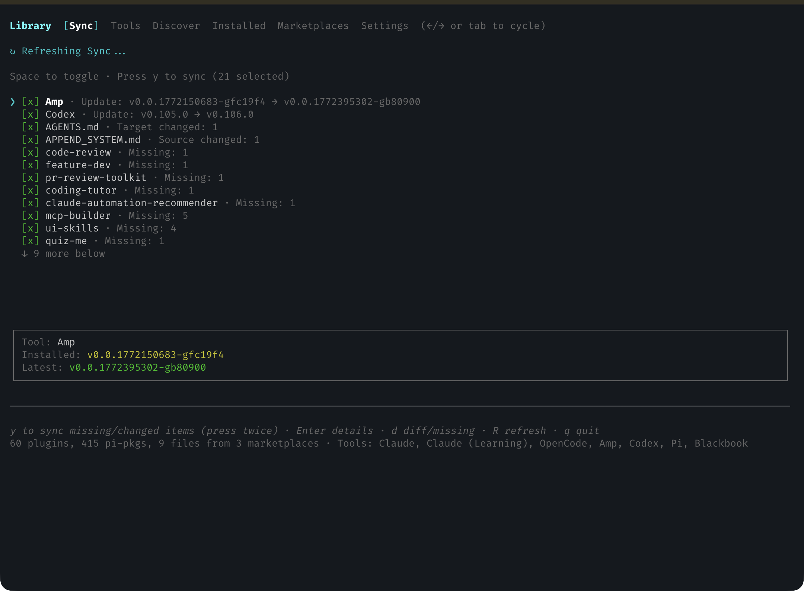

# Blackbook

[](https://www.npmjs.com/package/@ssweens/blackbook)
[](https://opensource.org/licenses/Apache-2.0)
[](https://github.com/ssweens/blackbook/actions/workflows/ci.yml)

Plugin manager for agentic coding tools built with React/Ink. Install skills, commands, agents, and synced assets from marketplaces to Claude Code, OpenAI Codex, OpenCode, and Amp.







## Features
- **Unified AGENTS.md/CLAUDE.md management** - Sync shared instruction files across tools
- **Unified plugin management** across multiple AI coding tools
- **Plugin conversion** - Automatically adapt plugins between different tool formats
- **Marketplace support** - Browse and install from official and community marketplaces
- **TUI interface** - Interactive terminal UI for plugin discovery and management
- **Cross-tool sync** - Install plugins to multiple tools at once

## Plugin Model

Everything is a plugin. Plugins can include skills, commands, agents, hooks, MCP servers, and LSP servers.

## Supported Tools

| Tool | Config Directory | Skills | Commands | Agents |
|------|------------------|--------|----------|--------|
| Claude Code | `~/.claude` | ✓ | ✓ | ✓ |
| OpenAI Codex | `~/.codex` | ✓ | — | — |
| OpenCode | `~/.config/opencode` | ✓ | ✓ | ✓ |
| Amp Code | `~/.config/amp` | ✓ | ✓ | ✓ |

## Installation

```bash
# Install from npm
npm install -g @ssweens/blackbook
blackbook
```

Or run directly with npx:

```bash
npx @ssweens/blackbook
```

Or clone and run from source:

```bash
git clone https://github.com/ssweens/blackbook ~/src/blackbook
cd ~/src/blackbook/tui
pnpm install
pnpm start
```

## Usage

Launch the TUI:

```bash
cd ~/src/blackbook/tui && pnpm start
```

### Navigation

| Key | Action |
|-----|--------|
| Tab / ← → | Switch tabs |
| ↑ ↓ | Navigate lists |
| Enter | Select / open details |
| Space | Install/uninstall selected plugin |
| / | Focus search (Discover/Installed) |
| Esc | Back from details or exit search |
| q | Quit |

### Shortcuts

- **Discover/Installed**: `s` cycle sort (name/installed), `r` reverse sort
- **Marketplaces**: `u` update marketplace, `r` remove marketplace
- **Tools**: `Enter`/`Space` toggle enabled, `e` edit config dir
- **Sync**: `y` sync missing/drifted items (press twice to confirm)

## Configuration

Blackbook uses a single config file at `~/.config/blackbook/config.toml`.

### Prerequisites

- `git` is required to download plugins from repositories.
- The Claude CLI is required only for managing Claude Code instances; other tools can still use direct file copies.

### Config File Location

```
~/.config/blackbook/config.toml
```

Or set `XDG_CONFIG_HOME` to use a custom location.

### Example Configuration

```toml
# ~/.config/blackbook/config.toml

# Marketplaces to fetch plugins from
# These extend the initial defaults and any Claude marketplaces
[marketplaces]
playbook = "https://raw.githubusercontent.com/ssweens/playbook/main/.claude-plugin/marketplace.json"
my-private = "https://raw.githubusercontent.com/myorg/plugins/main/.claude-plugin/marketplace.json"

# Enable tools (required)
[tools.claude-code]

[[tools.claude-code.instances]]
id = "claude-main"
name = "Claude"
enabled = true
config_dir = "~/.claude"

[[tools.claude-code.instances]]
id = "claude-learning"
name = "Claude Learning"
enabled = true
config_dir = "~/.claude-learning"

[tools.opencode]

[[tools.opencode.instances]]
id = "opencode"
name = "OpenCode"
enabled = true
config_dir = "~/.config/opencode"

```

Paths in `config_dir` (and local marketplace paths) support `~` expansion to your home directory.

### Assets

Assets let you sync user-level instruction files or folders (like `AGENTS.md`) into tool config directories. Sources can be local paths or HTTPS URLs.

```toml
[[assets]]
name = "AGENTS.md"
source = "~/dotfiles/AGENTS.md"
default_target = "AGENTS.md"

[assets.overrides]
"claude-code:default" = "CLAUDE.md"

[[assets]]
name = "agent-pack"
source = "~/dotfiles/agent-pack"
default_target = "agent-assets"

[[assets]]
name = "remote-agents"
source = "https://raw.githubusercontent.com/ssweens/my-private-repo/main/assets/AGENTS.md"
default_target = "AGENTS.md"
```

Assets are synced to enabled instances and show drift if the target differs from the source.

### Private Repositories

For private GitHub repos, set a token in your environment (optional for public URLs):

```bash
export GITHUB_TOKEN=ghp_xxxxxxxxxxxx
# or
export GH_TOKEN=ghp_xxxxxxxxxxxx
```

### Default Marketplaces

The default config includes Anthropic's official marketplace:

| Name | URL |
|------|-----|
| `claude-plugins-official` | https://raw.githubusercontent.com/anthropics/claude-plugins-official/main/.claude-plugin/marketplace.json |

If you already use Claude plugins, Blackbook also reads known marketplaces from `~/.claude/plugins/known_marketplaces.json`.

### Tools

Tools are only managed when enabled in config. On first run, Blackbook enables tool instances whose default config directories already exist. Use the Tools tab in the TUI to toggle enablement and edit config directories.

**Supported tools (default config paths):**
- Claude — `~/.claude`
- OpenCode — `~/.config/opencode`
- Amp — `~/.config/amp`
- Codex — `~/.codex`

**Supported plugin types:** skills, commands, agents, hooks, MCP servers, LSP servers.

Incomplete installs are detected when a plugin is missing from any enabled instance that supports it.


### Managing Marketplaces

**Via TUI:** Navigate to Marketplaces tab, select "Add Marketplace"

**Via config file:** Edit `~/.config/blackbook/config.toml` directly

```toml
[marketplaces]
my-marketplace = "https://raw.githubusercontent.com/user/repo/main/.claude-plugin/marketplace.json"
```

## Cache

Downloaded plugins and HTTP cache are stored in:

```
~/.cache/blackbook/
├── plugins/           # Downloaded plugin sources
└── http_cache/        # Cached marketplace data
└── assets/            # Cached asset URL sources
```

## Development

```bash
cd tui
pnpm install
pnpm dev          # Run in development mode
pnpm test         # Run tests
pnpm typecheck    # Type check
pnpm build        # Build for production
```

See `docs/TEST_COVERAGE.md` for the user-flow checklist and coverage status.

```bash
cd tui
npm install
npm run dev
npm test
npm run typecheck
npm run build
```

### TUI Code Layout

- `tui/src/cli.tsx` entry point
- `tui/src/App.tsx` app shell
- `tui/src/components/` UI components
- `tui/src/lib/` config, marketplace, install, state
