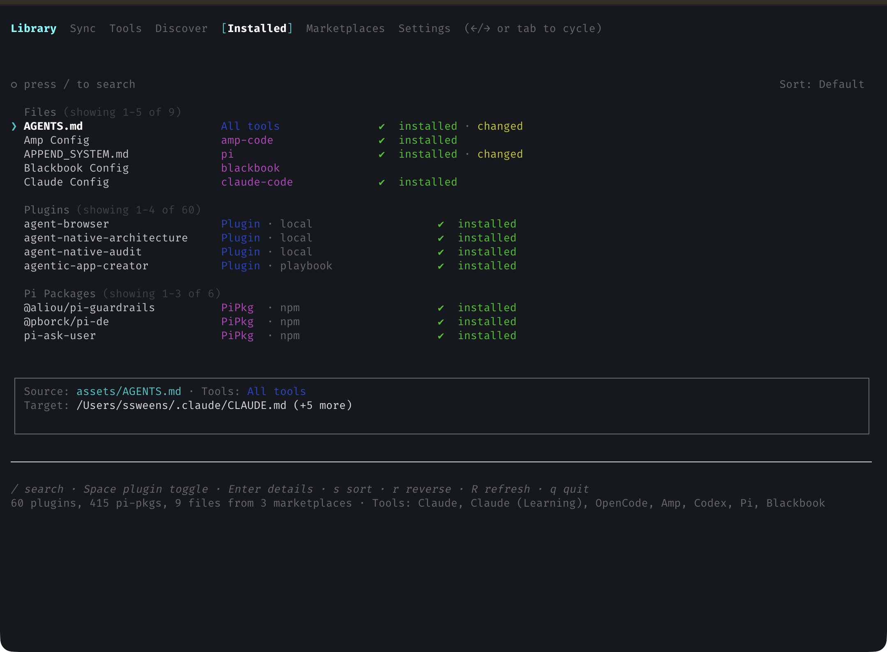
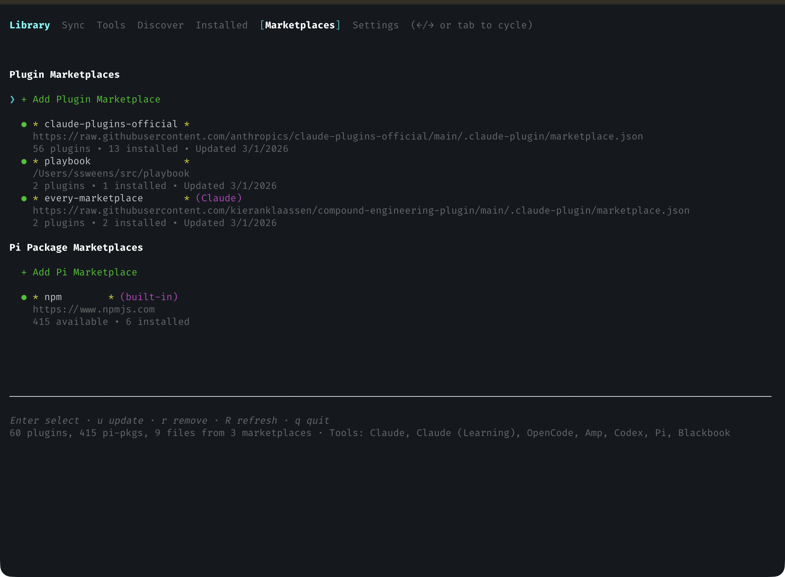

# Blackbook

[](https://www.npmjs.com/package/@ssweens/blackbook)
[](https://opensource.org/licenses/Apache-2.0)
[](https://github.com/ssweens/blackbook/actions/workflows/ci.yml)

Plugin manager for agentic coding tools built with React/Ink. Install skills, commands, agents, and synced assets from marketplaces to Claude Code, OpenAI Codex, OpenCode, Amp, and Pi. Sync config files and shared instruction files (AGENTS.md/CLAUDE.md) across all your tools with drift detection and diff viewing.







## Features
- **Unified AGENTS.md/CLAUDE.md management** — Sync shared instruction files across tools with per-tool target overrides
- **Config file syncing** — Sync tool-specific configs (settings, themes, keybindings) from a central repository
- **Drift detection & diff view** — SHA256-based drift detection with unified diff viewing for changed files
- **Multi-file sync** — Directory and glob pattern support for syncing multiple files at once
- **Unified plugin management** — Install skills, commands, agents, hooks, MCP/LSP servers across tools
- **Marketplace support** — Browse and install from official and community marketplaces
- **Pi packages** — Built-in npm marketplace for Pi coding agent extensions, themes, and custom tools
- **TUI interface** — Interactive terminal UI with tabs for Sync, Tools, Discover, Installed, and Marketplaces
- **Cross-tool sync** — Install plugins to multiple tools at once, detect incomplete installs

## Plugin Model

Everything is a plugin. Plugins can include skills, commands, agents, hooks, MCP servers, and LSP servers.

## Supported Tools

| Tool | Config Directory | Skills | Commands | Agents | Config Sync |
|------|------------------|--------|----------|--------|-------------|
| Claude Code | `~/.claude` | ✓ | ✓ | ✓ | ✓ |
| OpenAI Codex | `~/.codex` | ✓ | — | — | ✓ |
| OpenCode | `~/.config/opencode` | ✓ | ✓ | ✓ | ✓ |
| Amp Code | `~/.config/amp` | ✓ | ✓ | ✓ | ✓ |
| Pi | `~/.pi` | ✓ | ✓* | — | ✓ |

\* Pi uses `agent/skills/` for skills and `agent/prompts/` for prompt templates (`/name` syntax)

## Installation

For local development, use Node.js 23.x and pnpm.

```bash
# Install from npm
npm install -g @ssweens/blackbook
blackbook
```

Or run directly with npx:

```bash
npx @ssweens/blackbook
```

Or clone and run from source:

```bash
git clone https://github.com/ssweens/blackbook ~/src/blackbook
cd ~/src/blackbook/tui
pnpm install
pnpm start
```

## Usage

Launch the TUI:

```bash
cd ~/src/blackbook/tui && pnpm start
```

Blackbook opens on the **Sync** tab by default.

### Navigation

| Key | Action |
|-----|--------|
| Tab / ← → | Switch tabs |
| ↑ ↓ | Navigate lists |
| Enter | Select / open details |
| Space | Install/uninstall selected plugin |
| / | Focus search (Discover/Installed) |
| d | View diff for drifted item (Sync tab) |
| R | Refresh current tab data |
| Esc | Back from details or exit search |
| q | Quit |

### Shortcuts

- **Discover/Installed**: `s` cycle sort (name/installed), `r` reverse sort, `R` refresh tab data
- **Marketplaces**: `u` update marketplace, `r` remove marketplace, `R` refresh all marketplaces/packages
- **Tools**: `Enter` open detail, `i` install, `u` update, `d` uninstall, `Space` toggle enabled, `e` edit config dir, `R` refresh detection
- **Sync**: `y` sync selected items (missing/drifted assets/configs/plugins and tool updates; press twice to confirm), `R` refresh sync inputs

Blackbook also refreshes data when entering tabs (Discover, Installed, Marketplaces, Tools), throttled with a 30-second TTL per tab to avoid constant refetching/flicker while navigating. A loading indicator is shown across tabs (including Sync) while refresh is in progress.

## Configuration

Blackbook uses a single config file at `~/.config/blackbook/config.toml`.

### Prerequisites

- `git` is required to download plugins from repositories.
- The Claude CLI is required only for managing Claude Code instances; other tools can still use direct file copies.

### Config File Location

```
~/.config/blackbook/config.toml
```

Or set `XDG_CONFIG_HOME` to use a custom location.

### Example Configuration

```toml
# ~/.config/blackbook/config.toml

# Marketplaces to fetch plugins from
# These extend the initial defaults and any Claude marketplaces
[marketplaces]
playbook = "https://raw.githubusercontent.com/ssweens/playbook/main/.claude-plugin/marketplace.json"
my-private = "https://raw.githubusercontent.com/myorg/plugins/main/.claude-plugin/marketplace.json"

# Enable tools (required)
[tools.claude-code]

[[tools.claude-code.instances]]
id = "claude-main"
name = "Claude"
enabled = true
config_dir = "~/.claude"

[[tools.claude-code.instances]]
id = "claude-learning"
name = "Claude Learning"
enabled = true
config_dir = "~/.claude-learning"

[tools.opencode]

[[tools.opencode.instances]]
id = "opencode"
name = "OpenCode"
enabled = true
config_dir = "~/.config/opencode"

```

Paths in `config_dir` (and local marketplace paths) support `~` expansion to your home directory.

### Sync Repositories

Both assets and configs use central repositories for source files:

```toml
[sync]
config_repo = "~/src/playbook/config"    # Base for config sources
assets_repo = "~/src/playbook/assets"    # Base for asset sources (optional, defaults to config_repo)
```

If `assets_repo` is not specified, it defaults to `config_repo`. This allows a single repo for everything, or separate repos for different concerns.

### Assets vs Configs: Key Distinction

| Feature | Assets | Configs |
|---------|--------|---------|
| **Sync targets** | ALL enabled tools | Specific `tool_id` only |
| **Use case** | Shared files (AGENTS.md, prompts) | Tool-specific settings |
| **Per-instance overrides** | ✓ Different targets per tool | — |

### Assets

Assets sync user-level files (like `AGENTS.md`) to **all enabled tool instances**. Use assets for content that should be available everywhere.

#### Simple Asset (Single File)

```toml
[[assets]]
name = "AGENTS.md"
source = "AGENTS.md"                      # Relative to assets_repo
default_target = "AGENTS.md"

# Per-instance target overrides (optional)
[assets.overrides]
"claude-code:default" = "CLAUDE.md"       # Claude uses CLAUDE.md instead
"claude-code:claude-learning" = "CLAUDE.md"
```

#### Multi-File Asset

For multiple files, directories, or globs, use `[[assets.files]]`:

```toml
[[assets]]
name = "Prompt Library"

[[assets.files]]
source = "prompts/"                       # Directory (trailing /)
target = "prompts/"

[[assets.files]]
source = "templates/*.md"                 # Glob pattern
target = "templates/"

# Per-file overrides (optional)
[assets.files.overrides]
"claude-code:default" = "claude-templates/"
```

#### Path Resolution

Asset `source` paths are resolved in order:
1. **URLs** (`http://`, `https://`) — fetched and cached
2. **Absolute paths** (`/path/to/file`) — used directly
3. **Home-relative** (`~/path`) — expanded to home directory
4. **Relative paths** — resolved against `assets_repo`

```toml
# All of these work:
source = "AGENTS.md"                                    # Relative to assets_repo
source = "~/dotfiles/AGENTS.md"                         # Home-relative
source = "/absolute/path/to/AGENTS.md"                  # Absolute
source = "https://example.com/AGENTS.md"                # URL (cached)
```

### Configs

Configs sync tool-specific files to **only matching tool instances**. Use configs for settings that differ per tool.

#### Single File Config

```toml
[[configs]]
name = "Claude Settings"
tool_id = "claude-code"                   # Only syncs to claude-code instances
source_path = "claude-code/settings.json" # Relative to config_repo
target_path = "settings.json"             # Relative to tool's config_dir
```

#### Multi-File Config

For tools with multiple config files, use `[[configs.files]]`:

```toml
[[configs]]
name = "Pi Config"
tool_id = "pi"

[[configs.files]]
source = "pi/config.toml"
target = "config.toml"

[[configs.files]]
source = "pi/themes/"                     # Directory sync
target = "themes/"

[[configs.files]]
source = "pi/*.json"                      # Glob pattern
target = "."
```

### Source Patterns (Assets & Configs)

Both assets and configs support the same source patterns:

| Pattern | Example | Behavior |
|---------|---------|----------|
| Single file | `settings.json` | Syncs one file |
| Directory | `themes/` (trailing `/`) | Syncs all files recursively |
| Glob | `*.json`, `prompts/*.md` | Syncs matching files |

**Important behaviors:**
- Directory/glob sources are **flattened** to target (files go directly in target, not subdirectories)
- Files removed from source are **NOT** deleted from target (safety feature)
- Drift detection uses SHA256 hashing

### Example Repository Structure

```
~/src/playbook/
├── config/                      # config_repo
│   ├── claude-code/
│   │   └── settings.json
│   ├── pi/
│   │   ├── config.toml
│   │   └── themes/
│   └── opencode/
│       └── opencode.json
└── assets/                      # assets_repo
    ├── AGENTS.md
    ├── prompts/
    │   ├── review.md
    │   └── triage.md
    └── templates/
        └── handoff.md
```

Corresponding config:

```toml
[sync]
config_repo = "~/src/playbook/config"
assets_repo = "~/src/playbook/assets"

[[assets]]
name = "AGENTS.md"
source = "AGENTS.md"
default_target = "AGENTS.md"

[assets.overrides]
"claude-code:default" = "CLAUDE.md"

[[assets]]
name = "Prompts"

[[assets.files]]
source = "prompts/"
target = "prompts/"

[[configs]]
name = "Pi Config"
tool_id = "pi"

[[configs.files]]
source = "pi/"
target = "agent"
```

### Private Repositories

For private GitHub repos, set a token in your environment (optional for public URLs):

```bash
export GITHUB_TOKEN=ghp_xxxxxxxxxxxx
# or
export GH_TOKEN=ghp_xxxxxxxxxxxx
```

### Default Marketplaces

The default config includes Anthropic's official marketplace:

| Name | URL |
|------|-----|
| `claude-plugins-official` | https://raw.githubusercontent.com/anthropics/claude-plugins-official/main/.claude-plugin/marketplace.json |

If you already use Claude plugins, Blackbook also reads known marketplaces from `~/.claude/plugins/known_marketplaces.json`.

### Pi Packages

Blackbook includes a built-in npm marketplace for [Pi coding agent](https://github.com/anthropics/pi) packages. Packages tagged with the `pi-package` keyword on npm are automatically discovered and can be installed directly from the Discover tab.

Pi packages can include extensions, themes, custom tools, and skills. Install/uninstall uses `pi install` and `pi remove` CLI commands.

You can also add local Pi package directories as marketplaces:

```toml
[pi-marketplaces]
my-packages = "~/src/my-pi-packages"
```

### Tools

Blackbook manages the default tool set (Claude, OpenCode, Amp, Codex, Pi) from the Tools tab. Each row shows binary detection status, installed version, and update availability.

From Tools you can:
- Open detail (`Enter`)
- Install (`i`)
- Update (`u` when update is available)
- Uninstall (`d`)
- Toggle enablement (`Space`)
- Edit config directory (`e`)

If a tool has no configured instance yet, Blackbook shows a "Not configured" synthetic row so lifecycle actions are still available.

Detection runs per-tool and updates rows incrementally with a spinner while each tool's version/status is loading. The Tools tab also shows a global "Checking tool statuses" indicator until all tool checks complete.

For updates, Blackbook uses tool-native upgrade commands when available (e.g. `claude update`, `amp update`, `opencode upgrade`) to keep the active PATH binary in sync. Claude install uses the official installer script (`curl -fsSL https://claude.ai/install.sh | bash`).

**Supported tools (default config paths):**
- Claude — `~/.claude`
- OpenCode — `~/.config/opencode`
- Amp — `~/.config/amp`
- Codex — `~/.codex`
- Pi — `~/.pi`

Choose package manager for lifecycle commands in config (used by tools that install/update via npm/bun/pnpm):

```toml
[sync]
package_manager = "npm"   # "npm" | "bun" | "pnpm"
```

Native command exceptions:
- Claude install: `curl -fsSL https://claude.ai/install.sh | bash`
- Claude update: `claude update`
- Amp update: `amp update`
- OpenCode update: `opencode upgrade`

**Supported plugin types:** skills, commands, agents, hooks, MCP servers, LSP servers.

Incomplete installs are detected when a plugin is missing from any enabled instance that supports it.


### Managing Marketplaces

**Via TUI:** Navigate to Marketplaces tab, select "Add Marketplace"

**Via config file:** Edit `~/.config/blackbook/config.toml` directly

```toml
[marketplaces]
my-marketplace = "https://raw.githubusercontent.com/user/repo/main/.claude-plugin/marketplace.json"
```

## Cache

Downloaded plugins and HTTP cache are stored in:

```
~/.cache/blackbook/
├── plugins/           # Downloaded plugin sources
└── http_cache/        # Cached marketplace data
└── assets/            # Cached asset URL sources
```

Remote plugin marketplace responses are cached for up to 10 minutes before refetch.

## Development

```bash
cd tui
pnpm install
pnpm dev          # Run in development mode
pnpm test         # Run tests
pnpm typecheck    # Type check
pnpm build        # Build for production
```

See `docs/TEST_COVERAGE.md` for the user-flow checklist and coverage status.

```bash
cd tui
npm install
npm run dev
npm test
npm run typecheck
npm run build
```

### TUI Code Layout

- `tui/src/cli.tsx` entry point
- `tui/src/App.tsx` app shell
- `tui/src/components/` UI components
- `tui/src/lib/` config, marketplace, install, state
