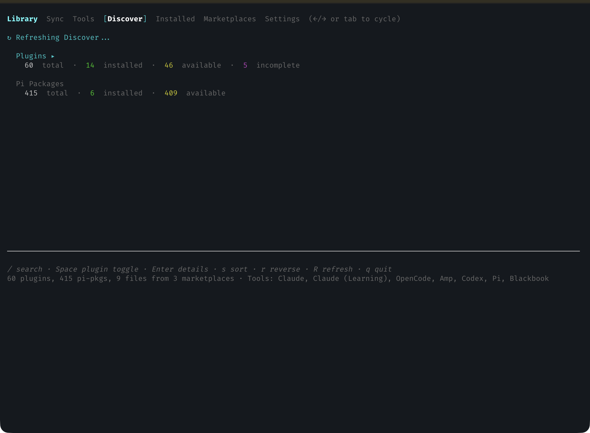
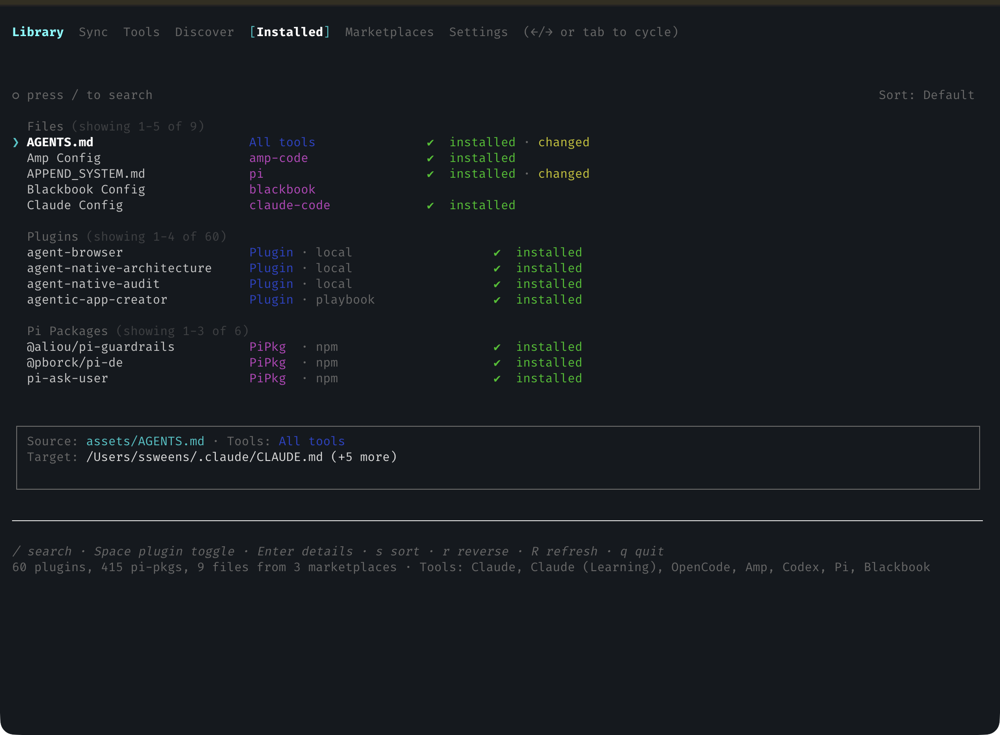
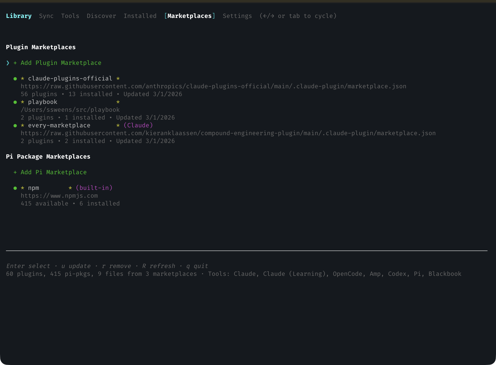
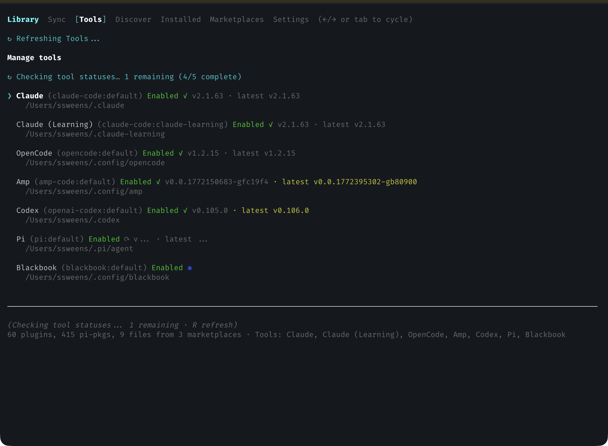
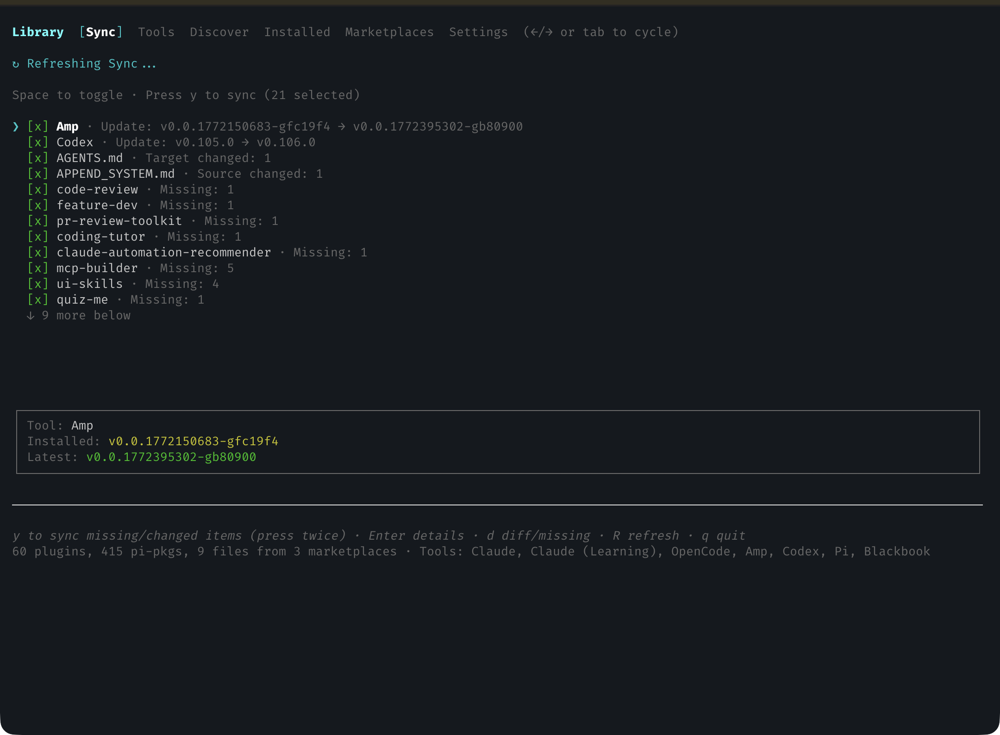

# Blackbook

[](https://www.npmjs.com/package/@ssweens/blackbook)
[](https://opensource.org/licenses/Apache-2.0)
[](https://github.com/ssweens/blackbook/actions/workflows/ci.yml)

Plugin manager for agentic coding tools built with React/Ink. Install skills, commands, agents, and synced assets from marketplaces to Claude Code, OpenAI Codex, OpenCode, Amp, and Pi. Sync config files and shared instruction files (AGENTS.md/CLAUDE.md) across all your tools with drift detection and diff viewing.











## Features
- **Unified AGENTS.md/CLAUDE.md management** — Sync shared instruction files across tools with per-tool target overrides
- **Config file syncing** — Sync tool-specific configs (settings, themes, keybindings) from a central repository
- **Drift detection & diff view** — SHA256-based drift detection with unified diff viewing for changed files
- **Reverse sync (pull back)** — Pull `target-changed` config changes from deployed instances back to the source repo
- **Multi-file sync** — Directory and glob pattern support for syncing multiple files at once
- **Unified plugin management** — Install skills, commands, agents, hooks, MCP/LSP servers across tools
- **Marketplace support** — Browse and install from official and community marketplaces
- **Pi packages** — Built-in npm marketplace for Pi coding agent extensions, themes, and custom tools
- **TUI interface** — Interactive terminal UI with tabs for Sync, Tools, Discover, Installed, Marketplaces, and Settings
- **Source repo git controls** — Settings tab shows upstream state (ahead/behind/diverged) and supports pull/commit flows
- **Cross-tool sync** — Install plugins to multiple tools at once, detect incomplete installs
- **Repo-prescribed installed rows** — Installed tab shows marketplace/source-repo plugins as `in git` even before local installation
- **Per-component control** — Disable individual skills, commands, or agents within a plugin
- **Per-project skills** — Bundled `npx skills` (`blackbook skills …`) that symlinks project skills from one central store instead of copying them into every repo

- **Advisory consultations** — Ask the configured Pi, Claude Code, or OpenCode runtime for bounded recommendations without automatic mutations

## Plugin Model

Everything is a plugin. Plugins can include skills, commands, agents, hooks, MCP servers, and LSP servers.

## Supported Tools

| Tool | Config Directory | Skills | Commands | Agents | MCP | Config Sync |
|------|------------------|--------|----------|--------|-----|-------------|
| Claude Code | `~/.claude` | ✓ (own dir, flat) | ✓ (flat) | ✓ (flat) | ✓ (native CLI) | ✓ |
| OpenAI Codex | `~/.codex` | ✓ (shared, see below) | — | — | — | ✓ |
| OpenCode | `~/.config/opencode` | ✓ (shared, see below) | ✓ | ✓ | ✓ (skill-bundled) | ✓ |
| Amp Code | `~/.config/amp` | ✓ (shared, see below) | ✓ | ✓ | ✓ (skill-bundled) | ✓ |
| Pi | `~/.pi/agent` | ✓ (shared, see below) | ✓ (own dir, flat) | — | ✓ (shared, see below) | ✓ |

Pi is a plain file-copy tool like OpenCode/Amp/Codex — plugin skills/commands install directly, with no separate bridge process or native registration step.

### Shared `.agents/skills`

Codex, OpenCode, Amp, and Pi all natively read skills from the emerging `.agents/skills` convention (project-level `.agents/skills/` and global `~/.agents/skills/`) in addition to — or instead of — a tool-specific directory. Codex in particular has no separate `.codex/skills` at all. Rather than installing a separate copy into each tool's own directory, Blackbook installs standalone skills and plugin-bundled skill components for these four tools straight into the shared `~/.agents/skills`, once. They also all show up as a dedicated `.agents` entry in the Tools tab, which owns the shared location independently of which specific tool binaries are installed.

Claude Code does not support `.agents/skills`, so its skills stay in `~/.claude/skills` as before.

Because Codex/OpenCode/Amp/Pi's skill installs now resolve to the same physical files, uninstalling a skill from one of them may remove it for the others too — the per-tool uninstall action is labeled accordingly when this applies. Upgrading from an older Blackbook version: existing skill installs under each tool's own directory (e.g. `~/.codex/skills`, `~/.config/opencode/skills`) are no longer tracked by Blackbook and are not automatically migrated or deleted — remove them manually once `~/.agents/skills` is populated via a normal sync.

### Flat-install namespacing (Claude, Pi commands)

Claude Code (skills/commands/agents) and Pi (commands only — its prompt loader doesn't support nested directories, unlike its skill loader) install components flat, with no per-plugin subfolder. To avoid two plugins' same-named component silently overwriting each other there, Blackbook prefixes the on-disk name with the owning plugin/namespace (e.g. `myplugin-verdict.md` instead of `verdict.md`) whenever it would otherwise collide. This is a display-invisible, disk-only naming scheme — skill/command frontmatter names are unaffected.

Upgrading from an older Blackbook version: existing flat installs keep their old un-prefixed filename on disk and are not automatically renamed — remove them manually once the new name is confirmed installed via a normal sync.

### MCP servers

A plugin that bundles an MCP server (`mcp.json`/`.mcp.json` at its root, or an inline `mcpServers` field in its marketplace/plugin manifest) gets it installed two ways, depending on what each tool actually reads:

- **Claude Code and Pi** both read a shared `{"mcpServers": {...}}` convention. Blackbook merges Claude's servers into `.claude.json` (`~/.claude.json` for the default instance), the file `claude mcp add` writes. Pi's go into `<Pi agent dir>/mcp.json` (`~/.pi/agent/mcp.json`), which Pi's built-in MCP support reads. `${CLAUDE_PLUGIN_ROOT}` is replaced with the plugin's directory, other keys in those files are kept, and servers the pi-plugins extension manages (marked `_piPlugins`) are never overwritten or removed. Servers older versions wrote to `~/.config/mcp/mcp.json` move on the next install.
- **Amp and OpenCode** read a skill-bundled `mcp.json` colocated with the skill directory itself (`~/.agents/skills/<skill>/mcp.json`) — Amp natively, OpenCode via a common (non-core) plugin. Blackbook copies the plugin's `mcp.json` alongside each skill it installs for these two.
- **Codex** has no shared-file MCP convention (its own config is TOML-based) and is out of scope for now.

## Installation

For local development, use Node.js 23.x and Bun.

```bash
# Install from npm
npm install -g @ssweens/blackbook
blackbook
```

Or run directly with npx:

```bash
npx @ssweens/blackbook
```

Or clone and run from source:

```bash
git clone https://github.com/ssweens/blackbook ~/src/blackbook
cd ~/src/blackbook/tui
bun install
bun start
```

## Usage

Launch the TUI:

```bash
cd ~/src/blackbook/tui && bun start
```

Blackbook opens on the **Sync** tab by default.

### Navigation

| Key | Action |
|-----|--------|
| Tab / ← → | Switch tabs |
| ↑ ↓ | Navigate lists |
| Enter | Select / open details |
| Space | Install/uninstall selected plugin |
| / | Focus search (Discover, Installed, a project's skills, the profile builder) |
| d | View diff for changed item (Sync tab) |
| p | Pull back config changes to source (Diff view) |
| R | Refresh current tab data |
| Esc | Back from details or exit search |
| q | Quit |

### Shortcuts

- **Discover/Installed**: `s` cycle sort (name/installed), `r` reverse sort, `R` refresh tab data (`d` opens diff for selected managed file in Installed)
- **Installed plugins** are grouped under a collapsible header per marketplace. `Enter` on a header collapses or expands that marketplace; a search expands every group so matches stay visible.
- **Projects and Profiles**: `Enter` opens the highlighted skill's detail view (contents, origin, browse files, add to profiles). In a project's drill-in, `p`/`u`/`e`/`d` still push, pull, toggle and remove. In the profile builder, saving moved off `Enter` to `S` so `Enter` can open the skill, and `Enter` on a marketplace or namespace header expands or collapses it.
- A project's drill-in groups its skills under a collapsible header per source-repo namespace, like the profile builder. `Enter` on a namespace header expands or collapses it; skills with no namespace are listed flat. A search expands every group so matches stay visible.
- **`g` opens a lock file's git detail** — the same diff / pull / push moves the skill views offer, over the file's real git state. On a profile (Profiles list) it acts on `profiles/<name>.skills-lock.json` in the source repo; in a project drill-in it acts on that project's `skills-lock.json`. The view shows branch, whether the file is committed, and ahead/behind counts, with actions to view the diff, commit, push, and pull.
- **Marketplaces**: `u` update marketplace, `r` remove marketplace, `R` refresh all marketplaces/packages
- **Tools**: `Enter` open detail, `i` install, `u` update, `d` uninstall, `Space` toggle enabled, `e` edit config dir, `R` refresh detection
- **Projects**: `Enter` open a project, `/` search its skills, `P` apply a profile, `S` save its lock as a profile, `a` add, `d` remove. Long lists scroll and show their position.
- **Skill detail**: `Add to profiles…` opens a checklist of profiles with the skill's current ones checked. `Space` toggles and `Enter` adds it to or removes it from each changed profile, keeping its known source.
- **Profiles**: `n` new, `Enter`/`e` edit, `d` delete. In the builder, `/` searches every skill as a flat list, `v` shows only the selected skills, `Space` toggles, `→`/`←` expand a group, `PgUp`/`PgDn` jump, and `Esc` clears a filter before leaving. Skills known only from a lock, such as `anthropics/skills`, are grouped under their source.
- **Sync**: `y` sync selected items (missing plus `source-changed` / `target-changed` / `both-changed` files/plugins and tool updates; press twice to confirm), `R` refresh sync inputs

Blackbook hydrates the initial tab on startup. Refresh/load data on the current tab with `R`. A loading indicator is shown while refresh is in progress.

### Advisory consultations

Press `c` in a project, while editing a profile, or from an installed-plugin detail. In **Settings**, select **Advisor Runtime** (`pi`, `claude-code`, or `opencode`) and optionally set **Advisor Model**; leave the model blank to use the selected CLI’s configured default.

Blackbook sends a bounded, redacted snapshot of the current view. The runtime runs in advisory mode without project mutation capabilities. Recommendations remain selectable proposals: accepting them uses the existing project/profile/detail action and never runs an action automatically.

After a response, press `c` to ask an optional follow-up. Blackbook carries the four newest redacted exchanges as conversational context, rebuilds the current snapshot for every turn, and shows the latest response with its turn number. Prior recommendations never override the current action contract.

### CLI Mode

Running `blackbook` with a recognized subcommand skips the interactive TUI entirely and runs non-interactively, exiting with a status code — useful for scripts and agents. Bare `blackbook` (no subcommand) still launches the TUI as above.

```bash
blackbook status [--tool <id>] [--json]      # what's out of sync
blackbook list [--tool <id>] [--json]        # everything tracked, with install state
blackbook sync [--tool <id>] [--yes] [--dry-run] [--json]
blackbook install <name>[@marketplace] [--json]
blackbook uninstall <name>[@marketplace] [--json]
blackbook skills <args...>                   # bundled `npx skills`, project skills in the central store
```

- `--tool <id>` scopes to one tool instance — matches a tool ID, display name, or `toolId:instanceId` (case-insensitive) when disambiguating multiple instances of the same tool.
- `--json` switches to machine-readable output on stdout (diagnostic/progress messages go to stderr).
- `sync` only auto-resolves the same "safe" subset the TUI's default bulk sync does (missing instances); `--yes` also force-overwrites conflicts and untracked existing targets. `--dry-run` prints what would sync without changing anything.
- `install`/`uninstall` resolve `<name>` against marketplace plugins first, then standalone skills, applying to all enabled tools.
- Exit code `0` on success, non-zero on any reported error (bad `--tool` value, unknown plugin/skill name, failed install, sync errors).
- CLI commands skip the TUI's background tool-binary version checks (network-dependent, only feeds "tool" status items) — a scriptable command shouldn't pay for that round-trip on every invocation.

## Project skills (`blackbook skills`)

Blackbook bundles the [skills CLI](https://github.com/vercel-labs/skills) (`npx skills`) and runs it as `blackbook skills …`. Every command and flag works as in upstream: `add`, `remove`, `list`, `update`, `experimental_install`, `experimental_sync`, and the rest. One thing is different: where a project's skills are stored.

Upstream copies each skill into `<project>/.agents/skills/<name>`. Blackbook's copy keeps **one shared copy per source and skill** in a central store and symlinks each project to it:

```
~/.local/share/blackbook/skills/              ($XDG_DATA_HOME/blackbook/skills)
  github.com/ssweens/playbook/blast-radius/
  local/Users/me/src/my-skills/pdf/
  ...

<project>/.agents/skills/blast-radius  -> ~/.local/share/blackbook/skills/github.com/ssweens/playbook/blast-radius
<project>/.claude/skills/blast-radius  -> (same)
<project>/skills-lock.json                (upstream format, commit via g or your own git)
```

- **Only linked skills are active.** A project sees only the skills in its own `skills-lock.json`. Global installs (`-g`) also live in the store: `~/.agents/skills/<name>` and `~/.claude/skills/<name>` are links to it, so the store can hold skills that are active in some projects but not globally.
- **One version.** The store key is the source (`github.com/<owner>/<repo>`, a git host and path, a well-known URL, a download URL, `local/<absolute path>`, or `node_modules/<package>`), never the ref. Every project shares the same copy. Running `blackbook skills update` in any project updates it for all projects.
- **Teammates** restore a clone with `blackbook skills experimental_install`, or with plain `npx skills experimental_install` if they don't use Blackbook.
- `remove` removes the links and lock entry and keeps the store copy for other projects.
- **One manager per skill.** Blackbook's own install, sync, and uninstall never write over, copy beside, or delete a skill the CLI manages. The Projects tab's Global workspace runs the CLI with `-g`.

The **Projects** tab uses the same CLI when `settings.project_skill_mode` is `link` (the default). Pushing a skill or applying a profile runs `skills add <source-repo origin> --skill … -a <enabled tools> -y` in the project. Deleting a linked skill runs `skills remove`. `copy` keeps the old behavior of copying into the project.

**Plugins.** Blackbook still installs, updates and removes plugins. A plugin's skills go through the bundled CLI, from the plugin's own folder in its repo, into the store with flat names and the global lockfile. One call covers the tools that share `~/.agents/skills`, and one call covers each Claude instance through `CLAUDE_CONFIG_DIR`. Commands, agents and MCP config still use Blackbook's own engine. Source-repo skills from the Sync tab install the same way.

**Sync tab skills.** The global lockfile (`~/.agents/.skill-lock.json`) decides which skills belong on your tools. A skill in the lock shows as missing on any enabled tool without it, and syncing installs it from the source the lock records. A source-repo skill that isn't in the lock is only available, never missing, so a lean global set stays lean. Drifted installs and installs with no known source still show for review. A local-path marketplace resolves to its git remote, so the store entries match standalone installs.

**Dev shortcuts.** Map a repo to a local checkout, on this machine only:

```yaml
settings:
  dev_shortcuts:
    github.com/ssweens/playbook: ~/src/playbook
```

When a skill source matches a repo exactly, its store entry is a live symlink into the checkout. Edits show up in every tool and project immediately, with no push or `update`. Lockfiles still record `ssweens/playbook`, so nothing machine-specific reaches projects or teammates. Remove the entry and reinstall to go back to normal copies.

Manage shortcuts in the **Settings** tab under Dev Shortcuts. Choose **Add dev shortcut** and enter the repo, then the checkout path. Press Enter on a shortcut to change its path, or `d` to remove it. A shortcut whose checkout is missing shows `(missing)`, and its repo is fetched normally.

### Profiles

A profile is a reusable piece of a `skills-lock.json`, stored in your source repo as `profiles/<name>.skills-lock.json`:

```json
{
  "version": 1,
  "skills": {
    "making-good-tracks": { "source": "ssweens/playbook", "sourceType": "github", "skillPath": "skills/making-good-tracks/SKILL.md" },
    "skill-creator": { "source": "anthropics/skills", "sourceType": "github", "skillPath": "skills/skill-creator/SKILL.md" }
  }
}
```

- **It's the upstream lockfile format,** so it works without Blackbook. Copy the entries into a project's `skills-lock.json` and run `npx skills experimental_install`.
- **Build profiles in the Profiles tab.** Each skill keeps its real source: a third-party skill's entry comes from your global lockfile, and a playbook skill's from the source repo's GitHub remote.
- **Apply one with `P`** from a project, or from the Global workspace. Blackbook runs one `skills add` per source for your enabled agents, so Claude gets links too, and uses `-g` for Global.
- **Save a project's lock as a profile with `S`** from the Projects tab, or from inside a project. Blackbook asks for a name and never overwrites an existing profile. A `local` entry inside your source repo is saved as the repo's GitHub source, and any other local path gets a warning because it only exists on this machine.
- **A project's `skills-lock.json` is the source of truth.** The Projects tab shows its skill count and each profile's coverage, as in `profile Music: 46/48 · 2 new — P to apply`. It also shows skills removed from a profile since you applied it here. Applying again adds the new skills and removes the dropped ones. Nothing changes a project on its own.
- **Lock files are written to disk, you commit them.** Saving a profile or changing a project's skills updates the lock file in its repo's working tree, without touching git. Press `g` to open its git detail and commit, push, or pull — the same diff/pull/push moves the skill views offer. Or use plain git. The Settings tab's source-repo control also commits and pushes the source repo (profiles included).
- **Coverage is computed** from the project's lock and the profile. The only extra state is a machine-local record of each apply, kept in `~/.cache/blackbook/profile-applications.json`, which is what makes the "removed" count possible.

Older profiles in `config.yaml` (lists of names) still show as "legacy". Saving one in the Profiles tab converts it to a file.

Vendoring details, the exact patch, and upgrade steps are in [`tui/vendor/skills/VENDOR.md`](tui/vendor/skills/VENDOR.md).

## Configuration

Blackbook uses YAML configuration files:

```
~/.config/blackbook/config.yaml       # Primary config
~/.config/blackbook/config.local.yaml # Machine-specific overrides (optional, gitignored)
```

On first launch, if `config.yaml` is missing, Blackbook bootstraps one from detected tool installations and prepopulates `files:` entries for known tool config files that already exist on disk.

### YAML Config

```yaml
# ~/.config/blackbook/config.yaml
settings:
  source_repo: ~/src/playbook
  package_manager: bun      # npm | pnpm | bun
  backup_retention: 3       # Number of backups to keep per file (1-100)
  consultation_runtime: pi # pi | claude-code | opencode
  consultation_model: ""   # Optional; blank uses the selected runtime default

tools:
  claude-code:
    - id: default
      name: Claude
      enabled: true
      config_dir: ~/.claude
    - id: learning
      name: Claude Learning
      enabled: true
      config_dir: ~/.claude-learning

files:
  - name: CLAUDE.md
    source: CLAUDE.md         # Relative to source_repo
    target: CLAUDE.md
    overrides:
      "opencode:default": AGENTS.md
  - name: Settings
    source: claude-code/settings.json
    target: settings.json
    tools: [claude-code]      # Only sync to specific tools

marketplaces:
  playbook: https://raw.githubusercontent.com/ssweens/playbook/main/.claude-plugin/marketplace.json
```

#### Local Overrides

`config.local.yaml` is deep-merged on top of `config.yaml`. Use it for machine-specific settings:

```yaml
# ~/.config/blackbook/config.local.yaml
settings:
  source_repo: ~/alternate/dotfiles

tools:
  claude-code:
    - id: default
      name: Claude
      config_dir: ~/custom/.claude
```

Arrays of objects merge by `name` or `id` key. Set a key to `null` to delete it from the base config.

#### Unified Files

The `files:` list manages all synced files in a single unified list:

| Feature | Description |
|---------|-------------|
| `tools` omitted | Syncs to all enabled, syncable tool instances |
| `tools: [claude-code]` | Syncs only to claude-code instances |
| `overrides` | Per-instance target path overrides |

#### Three-Way State

Managed files use deterministic hash-based drift detection instead of timestamps:

| Drift | Meaning | Action |
|-------|---------|--------|
| `source-changed` | You edited the source file | Forward sync (source → target) |
| `target-changed` | Tool edited the config | Pullback available (target → source) |
| `both-changed` | Both sides changed | Conflict — choose forward, pullback, or skip |
| `in-sync` | No changes since last sync | Nothing to do |

State is stored in `~/.cache/blackbook/state.json`.

### Private Repositories

For private GitHub repos, set a token in your environment (optional for public URLs):

```bash
export GITHUB_TOKEN=ghp_xxxxxxxxxxxx
# or
export GH_TOKEN=ghp_xxxxxxxxxxxx
```

### Default Marketplaces

The default config includes Anthropic's official marketplace:

| Name | URL |
|------|-----|
| `claude-plugins-official` | https://raw.githubusercontent.com/anthropics/claude-plugins-official/main/.claude-plugin/marketplace.json |

If you already use Claude plugins, Blackbook also reads known marketplaces from `~/.claude/plugins/known_marketplaces.json`.

### Pi Packages

Blackbook includes a built-in npm marketplace for [Pi coding agent](https://github.com/anthropics/pi) packages. Packages tagged with the `pi-package` keyword on npm are automatically discovered and can be installed directly from the Discover tab.

Pi packages can include extensions, themes, custom tools, and skills. Install/uninstall uses `pi install` and `pi remove` CLI commands.

To recommend packages from your synced Blackbook config/source repo, so every machine sees them in Discover and Installed, add `pi_packages`:

```yaml
pi_packages:
  - npm:pi-subagents
  - source: npm:pi-ask-user
    description: Ask the user from Pi workflows
```

This list is a catalog, not a requirement: each machine installs what it wants. Pi's own `~/.pi/agent/settings.json` defines what an install should have, so the Sync tab shows a Pi package only when those settings list it and it has an update or is missing on disk. A missing npm package is reinstalled, and a missing local path is reported for you to restore or remove. Installed Pi packages that are not listed in `pi_packages` show `not in git` and offer `Track in source repo` from their detail view. Recoverable installed plugins whose marketplace prescription disappeared also offer `Track in source repo`, copying the plugin into `<source_repo>/plugins/<name>` and registering it in `<source_repo>/.claude-plugin/marketplace.json`.

You can also add local Pi package directories as marketplaces:

Pi marketplaces are configured in the legacy config section and managed via the TUI Marketplaces tab.

### Tools

Blackbook manages the default tool set (Claude, OpenCode, Amp, Codex, Pi) from the Tools tab. Each row shows binary detection status, installed version, and update availability.

From Tools you can:
- Open detail (`Enter`)
- Install (`i`)
- Update (`u` when update is available)
- Uninstall (`d`)
- Toggle enablement (`Space`)
- Edit config directory (`e`)

If a tool has no configured instance yet, Blackbook shows a "Not configured" synthetic row so lifecycle actions are still available.

Detection runs per-tool and updates rows incrementally with a spinner while each tool's version/status is loading. The Tools tab also shows a global "Checking tool statuses" indicator until all tool checks complete.

For updates, Blackbook uses tool-native upgrade commands when available (e.g. `claude update`, `amp update`, `opencode upgrade`) to keep the active PATH binary in sync. Claude install uses the official installer script (`curl -fsSL https://claude.ai/install.sh | bash`).

**Supported tools (default config paths):**
- Claude — `~/.claude`
- OpenCode — `~/.config/opencode`
- Amp — `~/.config/amp`
- Codex — `~/.codex`
- Pi — `~/.pi`

Choose package manager for lifecycle commands in config (used by tools that install/update via npm/bun/pnpm):

```yaml
settings:
  package_manager: bun    # npm | pnpm | bun
```

Native command exceptions:
- Claude install: `curl -fsSL https://claude.ai/install.sh | bash`
- Claude update: `claude update`
- Amp update: `amp update`
- OpenCode update: `opencode upgrade`

**Supported plugin types:** skills, commands, agents, hooks, MCP servers, LSP servers.

Incomplete installs are detected when a plugin is missing from any enabled instance that supports it.

For Pi, installed plugin status and per-tool drift/diff come from the same file-copy manifest used for OpenCode/Amp/Codex — Pi has no separate native plugin registration.


### Managing Marketplaces

**Via TUI:** Navigate to Marketplaces tab, select "Add Marketplace"

**Via config file:** Edit `~/.config/blackbook/config.yaml` directly

```yaml
marketplaces:
  my-marketplace: "https://raw.githubusercontent.com/user/repo/main/.claude-plugin/marketplace.json"
```

## Cache

Downloaded plugins and HTTP cache are stored in:

```
~/.cache/blackbook/
├── plugins/           # Downloaded plugin sources
├── http_cache/        # Cached marketplace data
├── assets/            # Cached asset URL sources
├── backups/           # File backups before overwrite (configurable retention)
└── state.json         # Three-way state tracking for pullback files
```

Remote plugin marketplace responses are cached for up to 10 minutes before refetch.

The project **skill store** is deliberately *not* under the cache. It lives in `~/.local/share/blackbook/skills` (`$XDG_DATA_HOME`) because project symlinks point into it, so wiping the cache never breaks a project. If you delete the store, run `blackbook skills experimental_install` in each project to restore it.

## Development

```bash
cd tui
bun install
bun dev          # Run in development mode
bun test         # Run tests
bun typecheck    # Type check
bun build        # Build for production
```

See `docs/TEST_COVERAGE.md` for the user-flow checklist and coverage status.

```bash
cd tui
bun install
bun dev
bun test
bun typecheck
bun build
```

### TUI Code Layout

- `tui/src/cli.tsx` entry point
- `tui/src/App.tsx` app shell
- `tui/src/components/` UI components
- `tui/src/lib/config/` YAML config loading, validation (zod), merge, path resolution
- `tui/src/lib/modules/` Ansible-inspired check/apply modules (file-copy, directory-sync, symlink, backup, cleanup, plugin install/remove)
- `tui/src/lib/playbooks/` Internal YAML tool playbooks (default tool definitions)
- `tui/src/lib/state.ts` Three-way state tracking for pullback-enabled files
- `tui/src/lib/store.ts` Zustand store (main state management)
- `tui/src/lib/config.ts` Config facade (YAML loading)
- `tui/src/lib/install.ts` Legacy plugin/file sync code (being replaced by modules)
